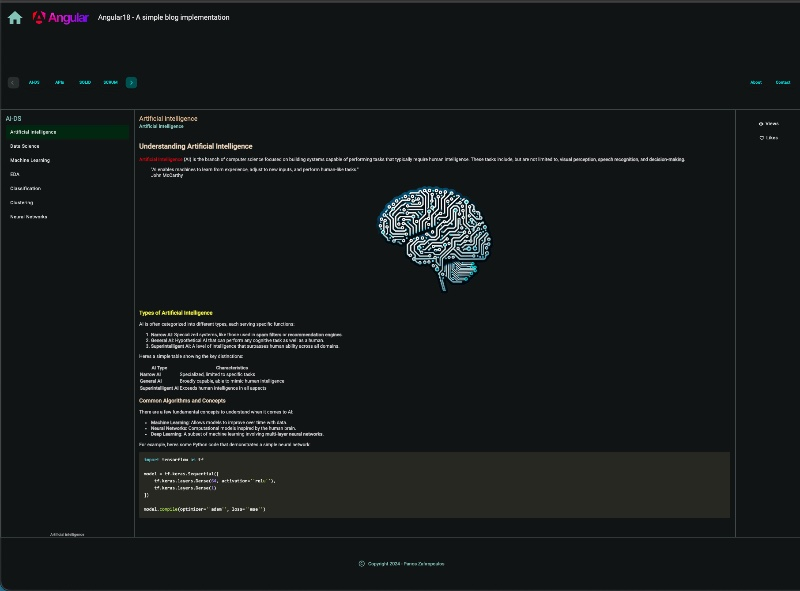

## ang18SlugSupportBlog1 
# Angular: Managing URL Slugs for your blog site 

 

### A sample Angular project for URL-Slug management for your blog.

<!--  -->

This repo is actually a sequel of the previous repo:
* [Angular: Revise the frontend project to incorporate Markdown content support for your blog site](https://github.com/zzpzaf/ang18MarkdownSupportBlog1)

The project uses as **backend**, the project: [blogbackdemo3](https://github.com/zzpzaf/blogbackdemo3)

Read more at my post: 
# "Angular: Managing URL Slugs for your blog site"
* **[Medium](https://medium.com/@zzpzaf.se)**
* **[DevXperiences](https://www.devxperiences.com/developers-posts/)** 

---